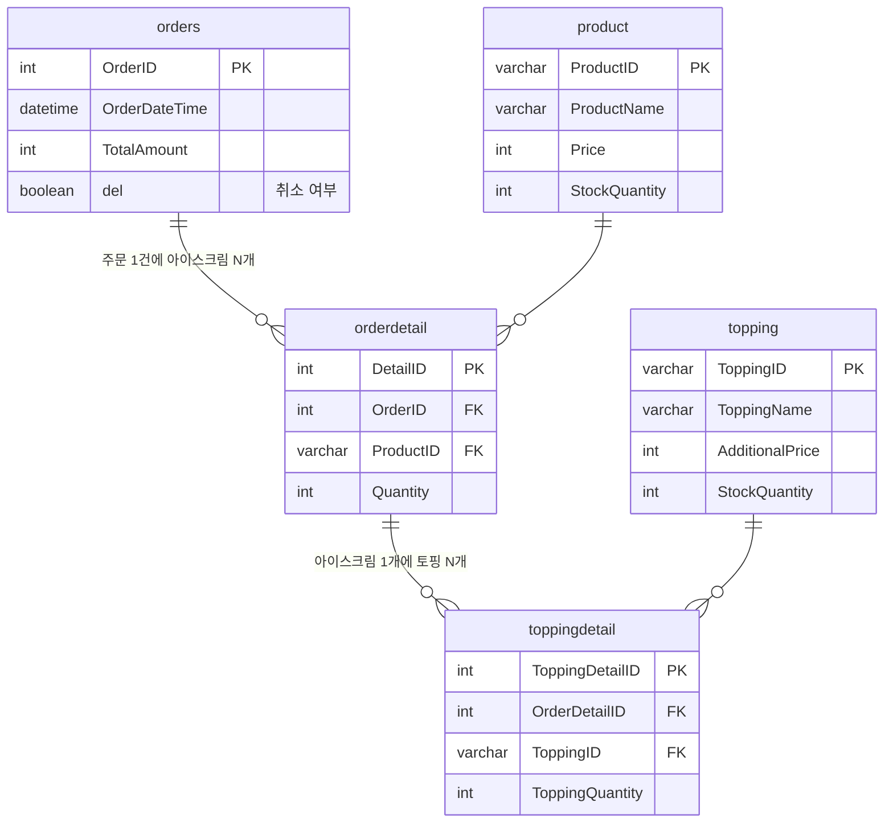

# 아이스크림 주문 REST API

아이스크림과 토핑을 골라 주문하고, 주문 내역을 조회, 취소하는 주문 시스템입니다.<br>
이전에 만들었던 주문 시스템을 REST API 구조로 다시 구현하면서 트랜잭션, 재고 동시성, 1:N 조회, 페이징을 보완했습니다.

| 버전 | 저장소 | 특징 |
|---|---|---|
| V1 | [icecream](https://github.com/tyt9/icecream) | Spring MVC + JSP, 주문 데이터를 문자열로 전송 후 서버에서 분리 |
| V2 | [IcecreamUpgraded](https://github.com/tyt9/IcecreamUpgraded) | Spring Boot + MyBatis XML, JSON 객체 |
| V3 | 이 저장소 | REST API, 트랜잭션, 재고 동시성 처리, 페이징, Swagger |

<br>

## 기술 스택

`Java 17` `Spring Boot 4.0` `MyBatis` `MySQL 8` `Thymeleaf` `jQuery` `Gradle` `Swagger`

<br>

## API

| 메서드 | 주소 | 설명 | 응답 |
|---|---|---|---|
| `GET` | `/api/products` | 상품 목록 | `200` |
| `POST` | `/api/orders` | 주문 생성 | `201` 주문번호 / `400` 입력 오류·품절·없는 상품 |
| `GET` | `/api/orders?page=1&size=10` | 주문 목록 (페이징) | `200` |
| `GET` | `/api/orders/{orderId}` | 주문 상세 (아이스크림 · 토핑) | `200` / `404` |
| `DELETE` | `/api/orders/{orderId}` | 주문 취소 (소프트 삭제) | `204` / `404` |

에러는 `{ "code": "SOLD_OUT", "message": "..." }` 형식으로 응답합니다.

<br>

## ERD



<br>

## 구현 설명

### 1. 여러 테이블에 나눠 저장하는 주문을 하나의 트랜잭션으로

주문 1건은 `orders` → `orderdetail` → `toppingdetail` 세 테이블에 나눠 저장됩니다.

- `@Transactional`로 묶어 중간에 실패하면 전부 취소되도록 했습니다.

### 2. 재고는 조건부 UPDATE로

```sql
UPDATE product SET StockQuantity = StockQuantity - 1
WHERE ProductID = #{productId} AND StockQuantity >= 1
```

- 재고를 먼저 조회하고 차감하면, 그 사이에 다른 주문이 끼어들어 재고가 음수가 될 수 있습니다.
- 확인과 차감을 한 문장으로 처리하고, 변경된 행이 0이면 품절로 판단합니다.


### 3. 1:N 조회를 중첩 객체로 매핑

5개 테이블을 조인하면 주문 1건이 여러 행으로 펼쳐집니다.<br>
화면에는 주문 → 아이스크림 → 토핑 구조로 보여줘야 해서, 펼쳐진 행을 다시 묶어야 했습니다.

| 버전 | 방식 | 문제                           |
|---|---|------------------------------|
| V1 | `GROUP_CONCAT`으로 토핑을 한 문자열로 합치고, 화면에서 이전 행의 주문번호를 기억해 중복을 건너뜀 | JSP에서 Thymeleaf로 바꾸자 동작하지 않음 |
| V2 | 주문상세 목록을 조회한 뒤, 상세마다 토핑을 따로 조회 | 상세 수만큼 쿼리 실행                 |
| V3 | 조인 쿼리 1번 + MyBatis `<collection>`으로 중첩 객체 매핑 | —                            |


### 4. 페이징

`LIMIT size OFFSET (page - 1) * size`로 조회하고, 전체 건수로 총 페이지 수를 계산해 `{ orders, page, totalPages }` 형태로 응답합니다.

<br>

## 개선 예정

- [x] 요청 값 검증(`@Valid`) 및 에러 응답 형식 통일 (`@RestControllerAdvice`)
- [x] 존재하지 않는 상품과 품절 상품 구분
- [ ] 주문 상세에 주문 시점의 상품명 · 단가 저장 (가격이 바뀌어도 과거 주문 금액이 변하지 않도록)

<br>

